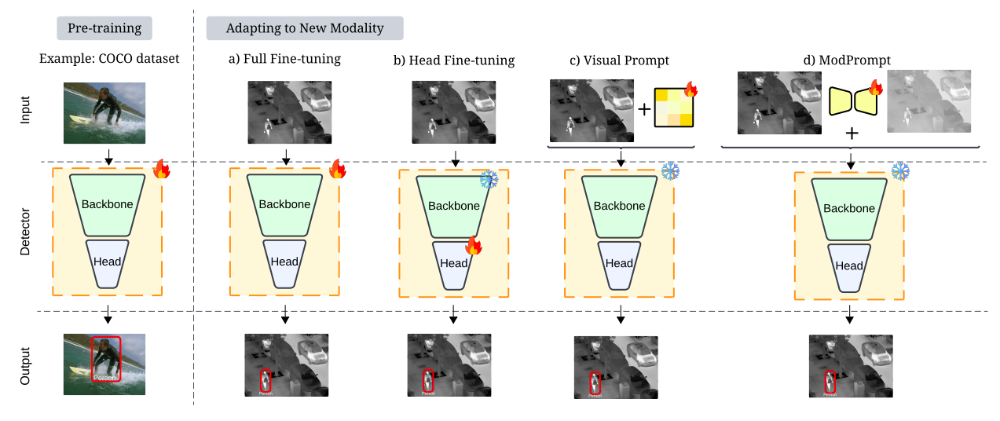
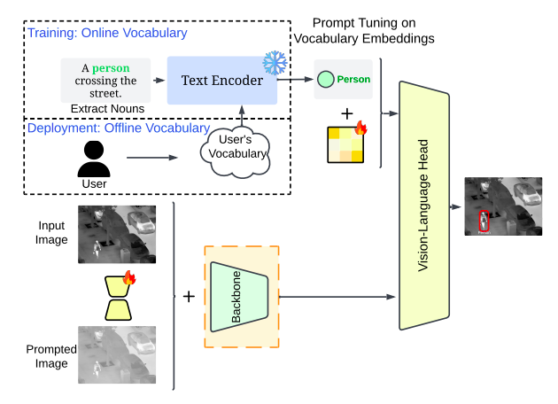
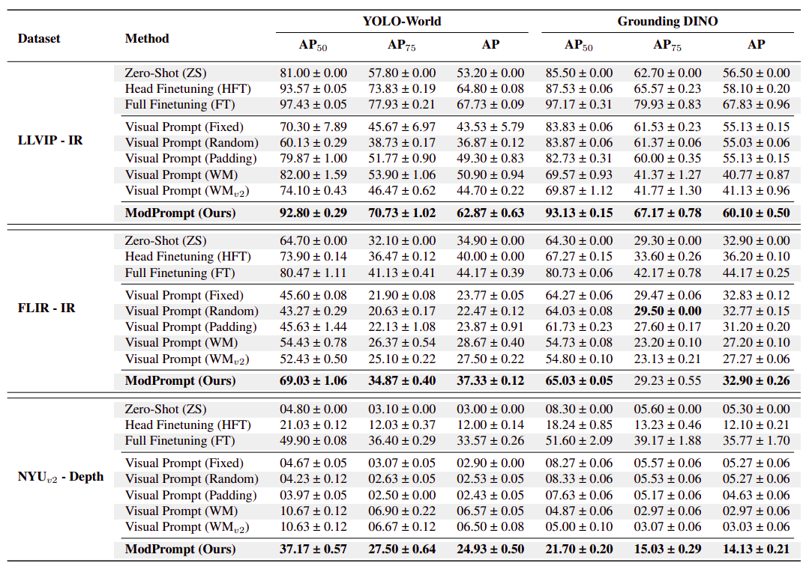

# ModPrompt: Visual Modality Prompt for Adapting Vision-Language Object Detectors

This is the repository for our paper ModPrompt: Visual (Mod)ality (Prompt) for Adapting Vision-Language Object Detectors 🔗 by Heitor Rapela Medeiros, Atif Belal, Srikanth Muralidharan, Eric Granger and Marco Pedersoli.

## News

 - Paper is under review, code will be released soon.
 - Arxiv: ***
 - If you find any problem or have any questions, please feel free to contact us!

## ModPrompt + Task Residuals

## Benchmarking

## References

    - Thanks to the great open-source community that provided good libraries.
    - This code is based on MMDET, YOLO-World, Grounding DINO and Visual Prompt.